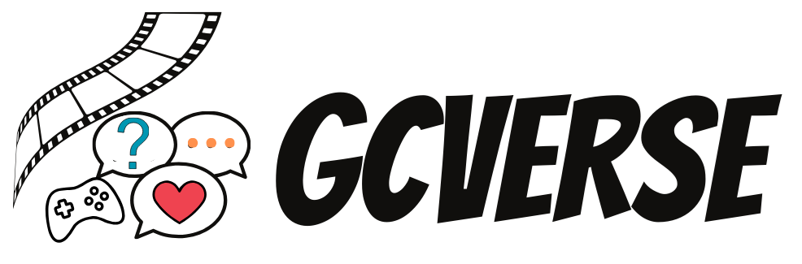
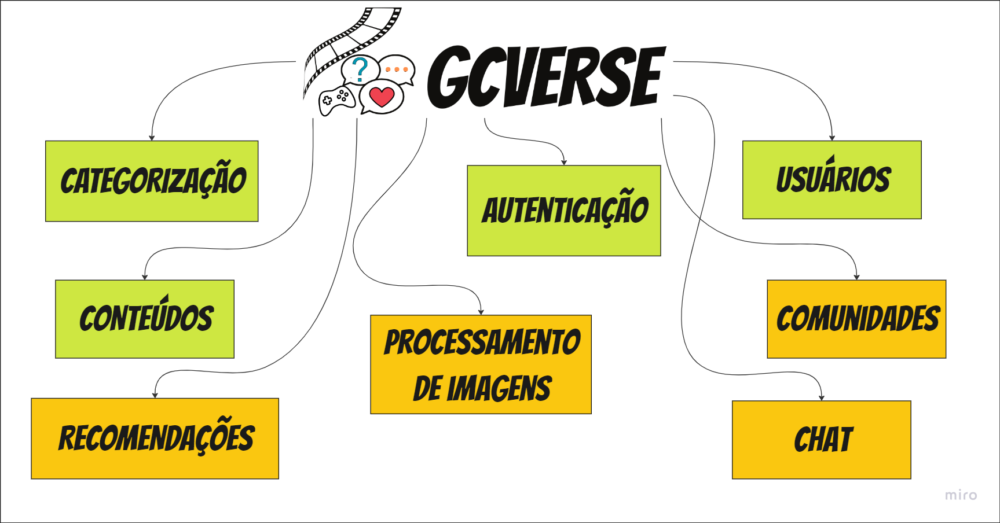
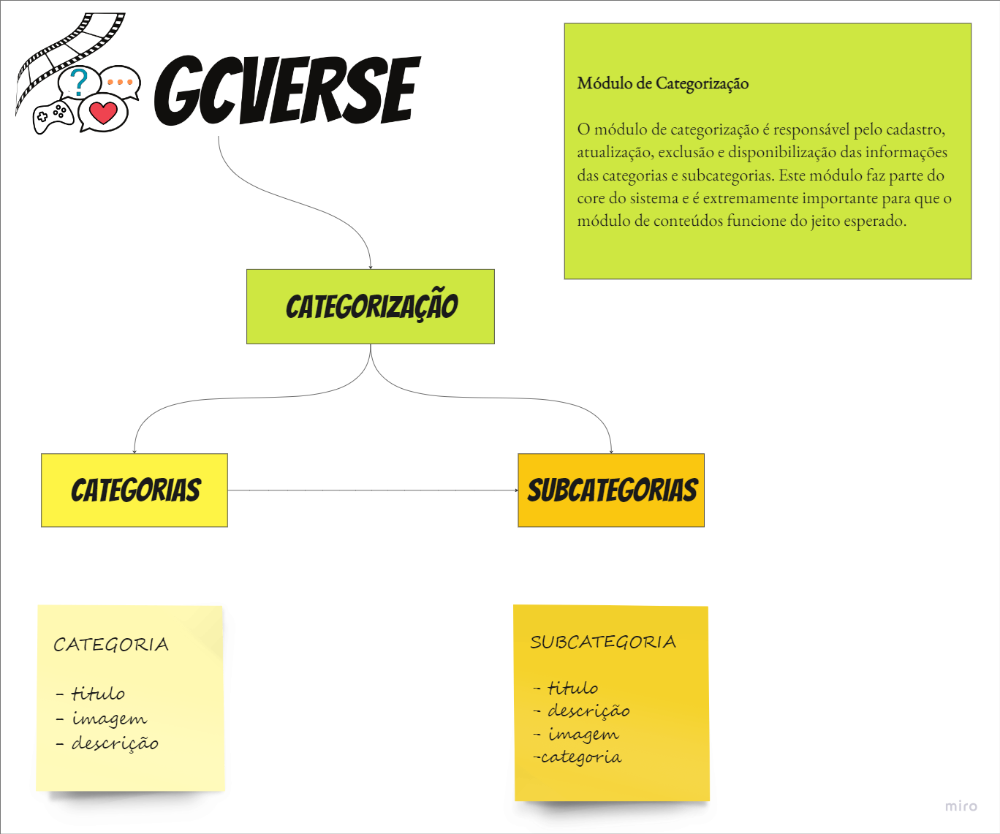
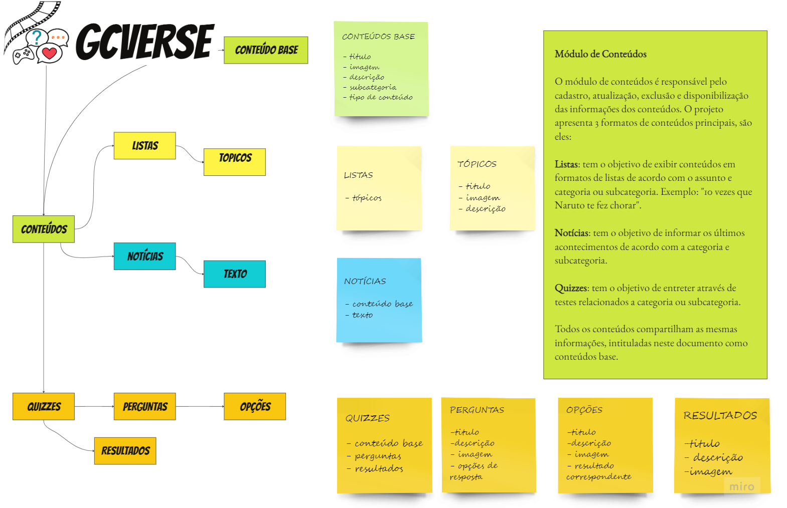

# GcVerse (New Universe) Project

GcVerse é um projeto desenvolvido por mim como entrega final de um dos módulos do curso de pós graduação. Esse projeto tem como objetivo se tornar um lugar seguro e divertido na internet onde os jovens possam encontrar notícias fresquinhas, quizzes divertidos, listas e recomendações de conteúdo dos mais variados assuntos. A ideia é a construção de uma nova rede social que concentre entretenimento, informação com foco na cultura geek e asiatica que está em alta atualmente, principalemente entre a geração mais nova.

## Desenvolvido Por

[Larissa Caroline de Andrade Mariano](https://github.com/larissamariano)

## Repositories
* SQL [link](./Sql/script-create-database-tables-gcverse.txt)
* API [link](./GcVerse)
* Postman Collection [link](./PostmanCollection/GcVerse.postman_collection.json)

## Desenvolvimento 

Para rodar esse projeto você precisa seguir os passos abaixo:

* Rode o script dentro da pasta SQL para criar o banco de dados e inserir os dados necessários.
* Rode o projeto da API, as configurações do localhost estão disponíveis no [lauchSettings.json (Profile: GcVerse.Application))](GcVerse/GcVerse.Application/Properties/launchSettings.json)
* Depois do projeto funcionando, você pode utilizar a collection do postman com todas as requisições do sistema para realizar os testes na API, além da documentação do SWAGGER que também está funcional. Não se esqueça de realizar a autenticação!

## Banco de Dados

Esse projeto está usando SQL Server.
Se seu ambiente estiver OK, você precisa rodar esse script [link](./Sql/script-create-database-tables-gcverse.txt).

## API

Essa API foi desenvolvida em .NET 6 e apresenta uma simples arquitetura de camadas. Para rodar esse projeto use VS Code ou VS 2022. [link](./api)

## Autenticação

O projeto da API principal apresenta as rotas de autenticação. Nesse processo foi utilizado JWT. 

Credentials:
Email: lari_carolline96@hotmail.com
Password: Amorinha@230796

## Levantamento de Requisitos

GCVerse apresenta os seguintes módulos, nesse projeto foram implementados os módulos de categorização, conteúdo, usuários e autenticação que estão representados no diagrama na cor verde.

Abaixo você encontra algumas informações sobre o módulo de categorização:

Abaixo você encontra algumas informações sobre o módulo de conteúdo:

